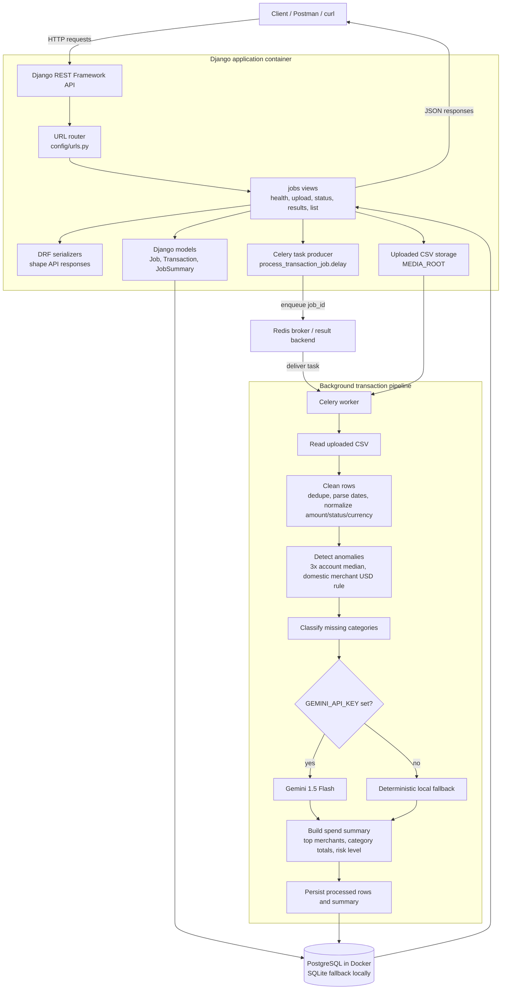
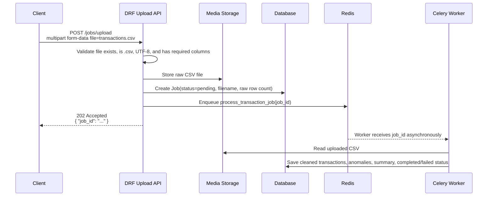
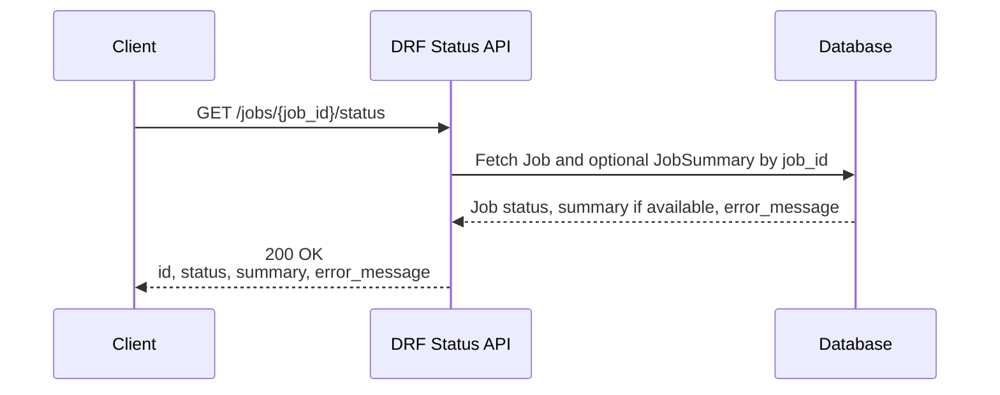
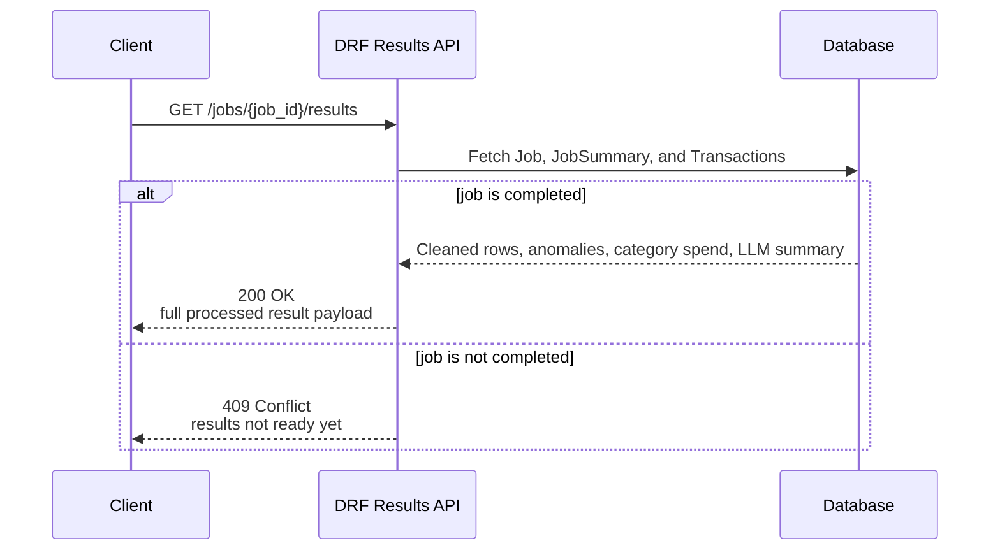
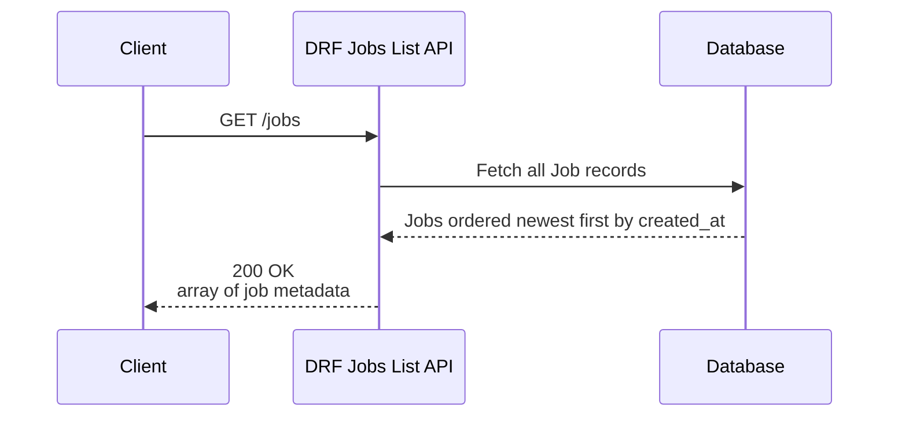
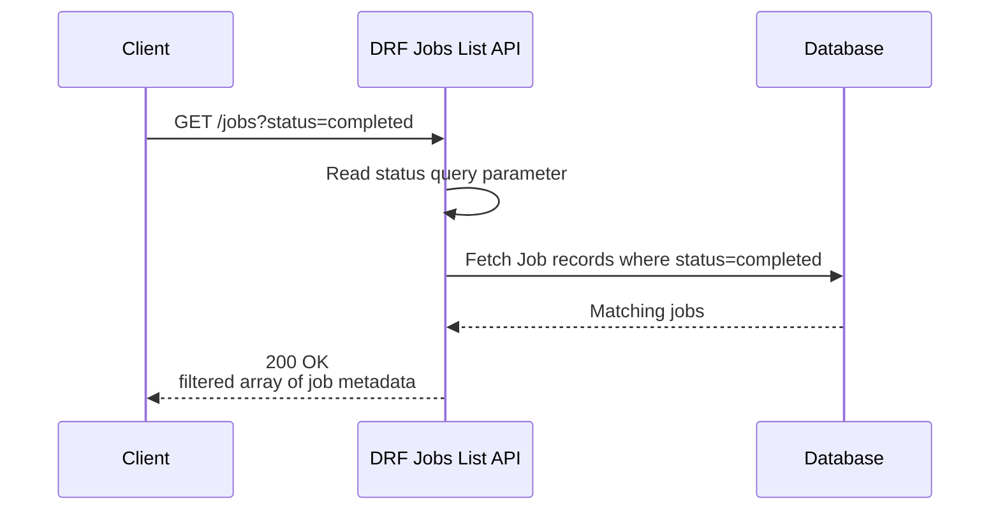

# AI-Powered Transaction Processing Pipeline

Django REST Framework API with PostgreSQL, Redis, and Celery for asynchronous
CSV transaction processing. The system accepts a transaction CSV, stores a job,
processes it in the background, applies cleaning/anomaly/LLM enrichment logic,
and exposes polling APIs for status and results.

## Run

Run the full stack from the repository root:

```bash
docker compose up --build
```

The API starts on `http://localhost:8000`.

## Detailed Architecture



### Main Components

- `Client / Postman / curl`: Sends upload, polling, listing, and result requests.
- `Django REST Framework API`: Validates requests and returns JSON responses.
- `Job`: Tracks each CSV processing run and its status.
- `Transaction`: Stores cleaned transaction rows and anomaly fields.
- `JobSummary`: Stores spend totals, category breakdown, narrative, and risk level.
- `Redis`: Queues background Celery work.
- `Celery worker`: Runs the heavy CSV processing outside the request cycle.
- `Gemini 1.5 Flash`: Optional LLM enrichment when `GEMINI_API_KEY` is configured.
- `Local fallback`: Keeps the project runnable without paid LLM setup.
- `PostgreSQL / SQLite`: Stores jobs, transactions, and summaries.

The worker uses Gemini 1.5 Flash when `GEMINI_API_KEY` is set in `code/.env`;
otherwise it uses a deterministic local fallback so the project runs without paid
API setup.

## API Endpoints and Data Flow

### Upload Transaction CSV

```bash
curl -F "file=@DevOps Assignment/transactions.csv" http://localhost:8000/jobs/upload
```



Expected response:

```json
{
  "job_id": "6c66036f-a6b8-4df4-95e3-2e5f83d4bcd5"
}
```

### Check Job Status

```bash
curl http://localhost:8000/jobs/<job_id>/status
```



The status can move through `pending`, `processing`, `completed`, or `failed`.
When processing is complete, a brief summary is returned with the status.

### Fetch Job Results

```bash
curl http://localhost:8000/jobs/<job_id>/results
```



The completed response includes:

- Cleaned transactions
- Flagged anomalies
- Category spend breakdown
- LLM/local fallback summary
- Raw and cleaned row counts

### List All Jobs

```bash
curl http://localhost:8000/jobs
```



Each job item contains the job id, status, filename, raw row count, and creation
timestamp.

### List Jobs by Status

```bash
curl http://localhost:8000/jobs?status=completed
```



Use this endpoint to quickly find jobs in a particular state, for example
`pending`, `processing`, `completed`, or `failed`.

## Processing Pipeline

```mermaid
flowchart LR
    CSV["Uploaded CSV"] --> Validate["Validate required columns"]
    Validate --> Job["Create Job"]
    Job --> Queue["Queue Celery task"]
    Queue --> Read["Read rows"]
    Read --> Clean["Clean and normalize"]
    Clean --> Dedupe["Remove exact duplicates"]
    Dedupe --> Anomaly["Flag anomalies"]
    Anomaly --> Category["Classify missing categories"]
    Category --> Summary["Generate summary"]
    Summary --> Save["Save Transactions and JobSummary"]
    Save --> Complete["Mark Job completed"]
```



## Postman Collection

Import `postman/AI-Powered-Transaction-Processing-Pipeline.postman_collection.json`
into Postman to test all API endpoints. The collection uses `baseUrl` set to
`http://localhost:8000` and stores the uploaded `job_id` automatically as
`jobId` for the status and results requests.

See [code/README.md](code/README.md) for additional pipeline notes.
