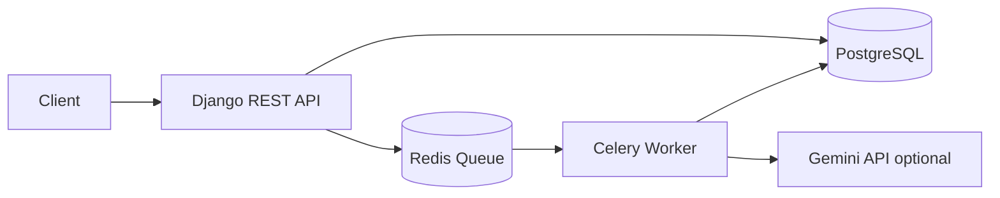

# AI-Powered Transaction Processing Pipeline

Django REST Framework API with PostgreSQL, Redis, and Celery for asynchronous CSV transaction processing.

## Run

```bash
docker compose up --build
```

The API starts on `http://localhost:8000`. Gemini is optional: set `GEMINI_API_KEY` in `.env` to use Gemini 1.5 Flash. Without a key, the worker uses deterministic local classification/summary fallback so the system still runs with no paid setup.

## Endpoints

Upload a CSV:

```bash
curl -F "file=@../DevOps_Assignment/transactions.csv" http://localhost:8000/jobs/upload
```

Check status:

```bash
curl http://localhost:8000/jobs/<job_id>/status
```

Fetch full results:

```bash
curl http://localhost:8000/jobs/<job_id>/results
```

List jobs, optionally filtered:

```bash
curl http://localhost:8000/jobs
curl http://localhost:8000/jobs?status=completed
```

## Pipeline

1. Upload creates a pending `Job` and enqueues Celery work.
2. Worker normalizes dates, amounts, casing, blank categories, and exact duplicates.
3. Worker flags account-median outliers and USD use at domestic-only merchants.
4. Missing categories are classified in one batch LLM call with 3 retry attempts and exponential backoff.
5. A single summary call produces spend totals, top merchants, anomaly count, narrative, and risk level.
6. Clean transactions, anomalies, category breakdown, and summary are persisted for polling APIs.

## High-Level Architecture


